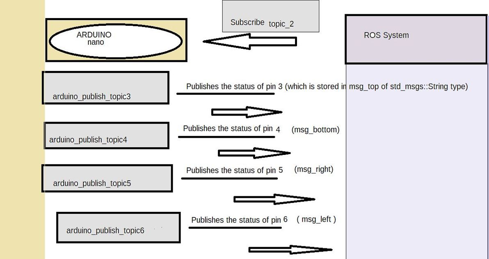
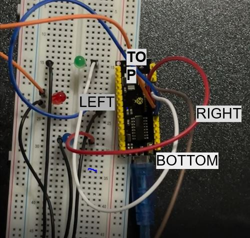

# Course_1_Arduino
## CODE OUTLINE
 The code has one topic subscriber through which it takes command from the ROS system and publishing the in status to four different topics to the ros system.
 
 # Communication
  **TOPIC Communication**
  
 # PUBLISHED TOPIC NAMES
 - arduino_publish_topic3
 - arduino_publish_topic4
 - arduino_publish_topic5
 - arduino_publish_topic6
 
 # SUBSCRIBED TOPIC NAME
 - topic_2
 
 ### CODE OUTLINE :
 
 ### ARDUINO CIRCUIT
 
